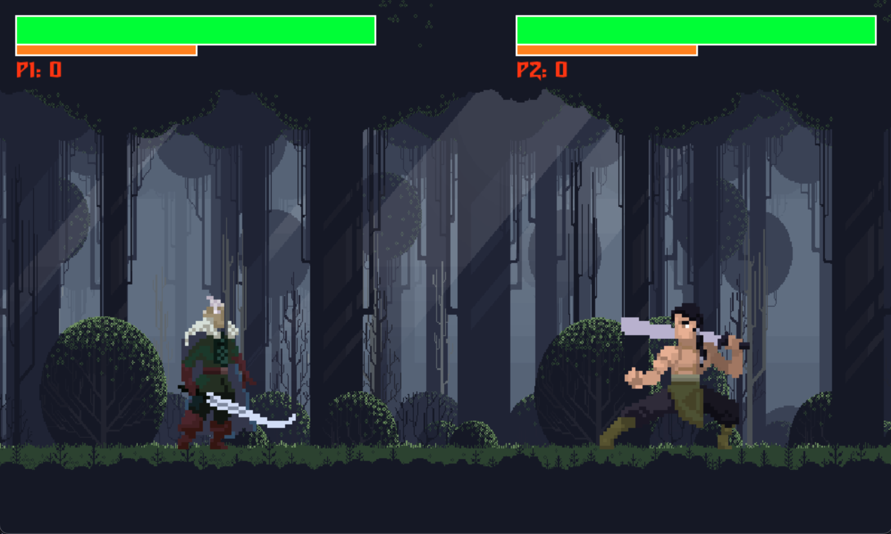
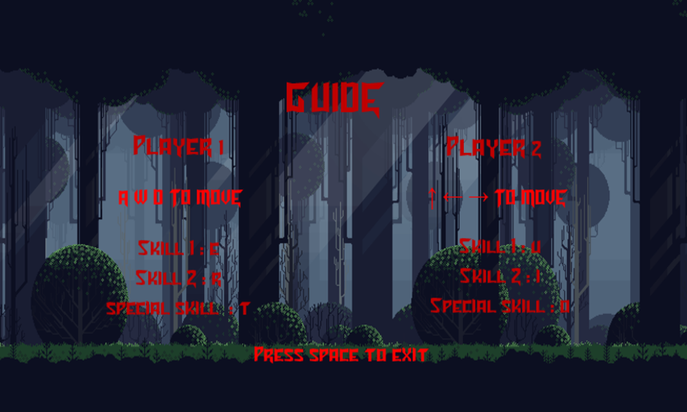
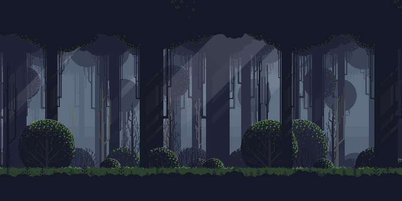
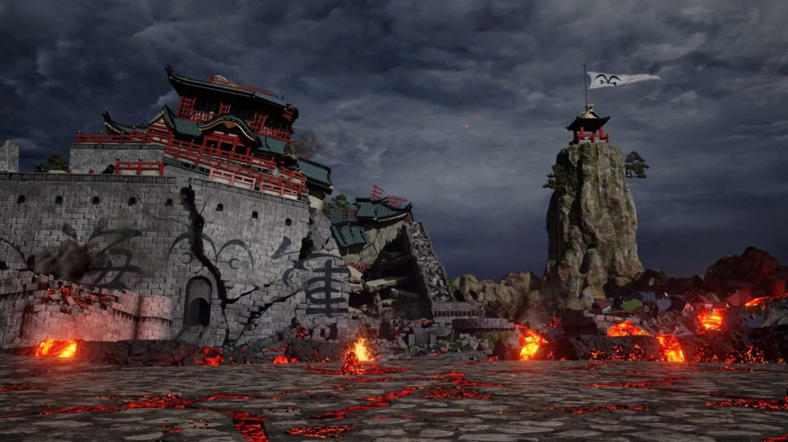
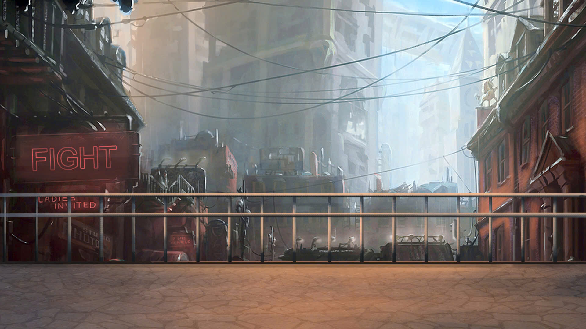

# Fighting Game

A simple 2D fighting game built with Pygame. Choose your character, select a map, and battle against another player or AI (if implemented).

## Features

- **Character Selection:** Choose from multiple characters, each with unique sprites and attack values (Knight, MartialHero, MedievalKing, MedievalKnight, Warrior, Huntress).
- **Map Selection:** Fight across different backgrounds (Mysterious Forest, Battlefield, Deserted City).
- **Two Game Modes:**
  - **Normal Mode:** Standard fighting gameplay.
  - **Special Mode:** Includes falling bombs for an extra challenge.
- **Basic Combat:** Includes movement (left/right, jump), three attack types, health bars, and mana bars.
- **Special Attacks:** Some characters (like Huntress) have unique ranged attacks.
- **Sound Effects & Music:** Background music and sound effects for attacks.
- **Game Menus:** Main menu, character selection, mode selection, map selection, pause menu, and guide screen.
- **Round System:** Win 2 rounds to win the match.

## How to Run

1.  **Prerequisites:** Make sure you have Python and Pygame installed.
    ```bash
    pip install pygame
    ```
2.  **Run the game:** Navigate to the project directory in your terminal and run:
    ```bash
    python main.py
    ```

## Controls

### Player 1

- **Move Left:** A
- **Move Right:** D
- **Jump:** W
- **Attack 1:** E
- **Attack 2:** R
- **Attack 3 (Special):** T (Requires 20 Mana)

### Player 2

- **Move Left:** Left Arrow
- **Move Right:** Right Arrow
- **Jump:** Up Arrow
- **Attack 1:** U
- **Attack 2:** I
- **Attack 3 (Special):** O (Requires 20 Mana)

### General

- **Pause/Resume:** Spacebar
- **Menu Navigation:** Arrow Keys (Up/Down/Left/Right)
- **Menu Select:** Enter

## Screenshots

**Gameplay Example:**


**Guide Screen:**


**Background Examples:**





## Credits

- **Game Logic & Code:** Based on various Pygame tutorials and custom implementation.
- **Character Sprites:** Located in `assets/images/` subdirectories.
  - Fantasy Warrior (`assets/images/warrior/`): Creative Commons Zero (CC-0) by LuizMelo
  - Medieval King Pack 2 (`assets/images/Medieval King Pack 2/`): Creative Commons Zero (CC-0) by LuizMelo
  - Huntress (`assets/images/Huntress/`): Creative Commons Zero (CC-0) by LuizMelo
  - Martial Hero 3 (`assets/images/Martial Hero 3/`): Creative Commons Zero (CC-0) by LuizMelo
  - Knight (`assets/images/Knight/`): Creative Commons Zero (CC-0) by LuizMelo
  - Medieval Warrior Pack (`assets/images/Medieval Warrior Pack/`): Creative Commons Zero (CC-0) by LuizMelo
- **Background Images:** Located in `assets/images/background/`.
- **Sound Effects & Music:** Located in `assets/audio/`.
- **Font:** Turok font (`assets/fonts/turok.ttf`)
